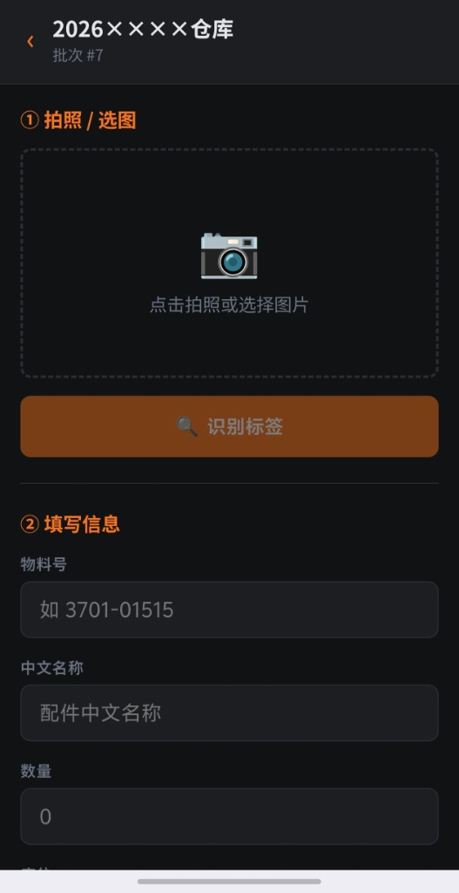
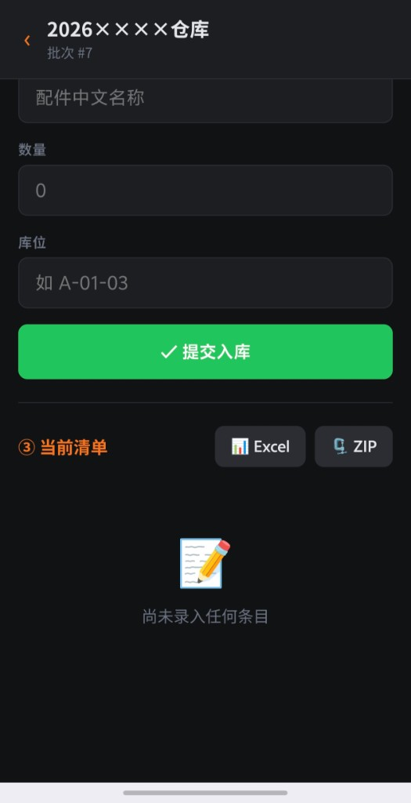

# AI Inventory Scanner

A mobile-first warehouse parts scanning and stock-in system. Capture or upload label photos, recognize part numbers with AI, manage batches, track locations, and export to Excel or ZIP.

---

## Screenshots

| Scan & Entry | List & Export |
|--------------|---------------|
|  |  |

Dark industrial UI, optimized for phones with large, touch-friendly controls.

---

## Features

- **Batch management** — Create, view, and delete batches; data persists across sessions
- **AI recognition** — Upload label photos to extract part number, Chinese name, and quantity (Zhipu GLM-4V-Plus)
- **Scan workflow** — Take a photo or pick from gallery; edit recognition results before submitting
- **Duplicate handling** — Merge quantity and append images, or create a new entry for the same part number
- **Multi-location** — Append locations on merge; skip duplicates automatically
- **Live inventory list** — Polls every 5 seconds; inline location editing and per-item delete
- **Export** — Excel or ZIP (includes an `images/` folder)
- **Path-based access** — Served under `/scan2026/` via Nginx; root path returns 404

---

## Tech Stack

| Layer | Technology |
|-------|------------|
| Backend | Python Flask + SQLite |
| Frontend | Vanilla HTML / CSS / JS (single-page, mobile-first) |
| AI | Zhipu GLM-4V-Plus |
| Deployment | Docker + Nginx |

---

## Project Structure

```
.
├── app.py                 # Flask application
├── templates/
│   └── index.html         # Single-page frontend
├── docs/screenshots/      # UI screenshots
├── requirements.txt
├── Dockerfile
├── docker-compose.yml
├── nginx.conf
├── .env.example
└── data/                  # Created at runtime (not committed)
    ├── db.sqlite
    └── uploads/
```

---

## Quick Start (Docker)

**Requirements:** Docker, Docker Compose

```bash
# 1. Clone the repository
git clone https://github.com/ZBHzaiye/ai-inventory-scanner.git
cd ai-inventory-scanner

# 2. Configure environment variables
cp .env.example .env
# Edit .env and set your Zhipu API key
# Get a key at: https://open.bigmodel.cn/usercenter/apikeys

# 3. Start services
docker compose up -d --build

# 4. Open in browser
# http://your-server-ip/scan2026/
```

---

## Local Development

```bash
python -m venv venv
# Windows
venv\Scripts\activate
# Linux / macOS
source venv/bin/activate

pip install -r requirements.txt
cp .env.example .env   # Set ZHIPU_API_KEY

# Without Nginx locally, set BASE to an empty string in templates/index.html:
# const BASE = '';

python app.py
# Visit http://localhost:5000
```

---

## Environment Variables

| Variable | Required | Description |
|----------|----------|-------------|
| `ZHIPU_API_KEY` | Yes | ZhipuAI API key for vision recognition |

---

## API Endpoints

| Method | Path | Description |
|--------|------|-------------|
| GET / POST | `/api/batches` | List or create batches |
| DELETE | `/api/batches/:id` | Delete a batch and related data |
| GET | `/api/batches/:id/items` | List items in a batch |
| POST | `/api/batches/:id/items` | Create an item |
| POST | `/api/recognize` | Recognize a label image |
| POST | `/api/batches/:id/check_duplicate` | Check for duplicate part numbers |
| PUT | `/api/items/:id` | Update an item |
| PUT | `/api/items/:id/merge` | Merge into an existing item |
| DELETE | `/api/items/:id` | Delete an item |
| GET | `/api/batches/:id/export/excel` | Export Excel |
| GET | `/api/batches/:id/export/zip` | Export ZIP |

---

## Data Cleanup

To remove all project data when finished:

```bash
docker compose down
rm -rf data/
```

---

## Change Access Path

The default path is `/scan2026/`. Update both:

1. `location /scan2026/` in `nginx.conf`
2. `const BASE = '/scan2026'` in `templates/index.html`

---

## Maintenance

```bash
docker compose logs -f flask    # View logs
docker compose restart          # Restart services
docker compose up -d --build    # Rebuild after code updates
```

---

## License

MIT
